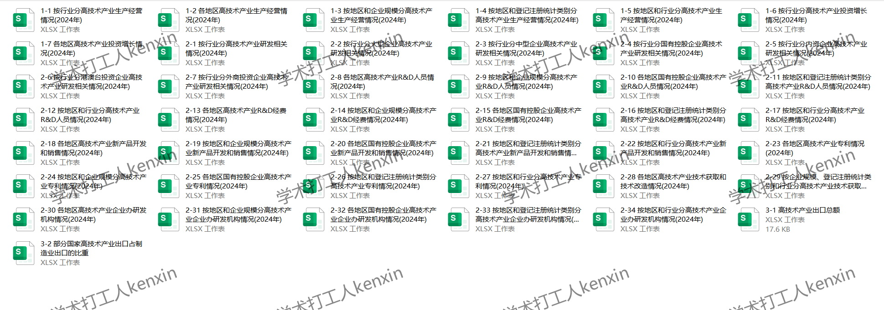
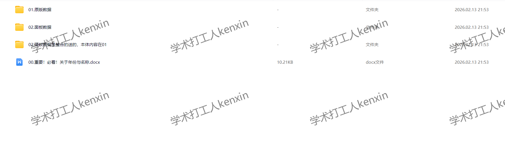

## Body

"China High-Tech Industry Statistical Yearbook" (2002-2025)

01. Data Introduction
"High-Tech Industry Statistical Yearbook"

02. Relevant Data and Indicators
Data Name: "China High-Tech Industry Statistical Yearbook"
Data Range: 31 provinces
Format: Excel for 25 years, other formats include Excel and PDF

03. Data Screenshots Available in the Images
(1) The directory is displayed in the images, please take your time to view them on your own. If you need assistance finding data, feel free to ask. We do not assist with data searches without purchase. After shipping, we do not support returns without a reason.
(2) The display directory is for 2025, due to limited space, only a portion of it is shown here. The statistical criteria may change from year to year. Academic common sense, the data recorded in statistical materials are also common sense. Please be aware of this.
(3) The Excel format data is compiled from original materials, including the content of the original data but not the text content.
(4) If the data is placed in a zip file, you need to save the zip file first, then download, and then extract.
(5) If there is an Excel protection, you can select all and copy to a new sheet to use.

## Images

Here is a pay link on Stripe ( https://buy.stripe.com/3cs8yP7sY87d0vu9AB ). Please contact me lonlonago@foxmail.com after funding $89, and I will send you a complete data files , thank you!

